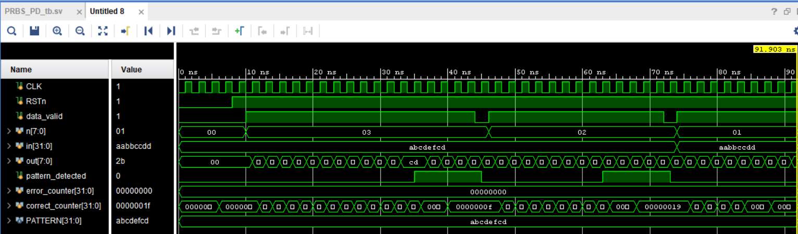
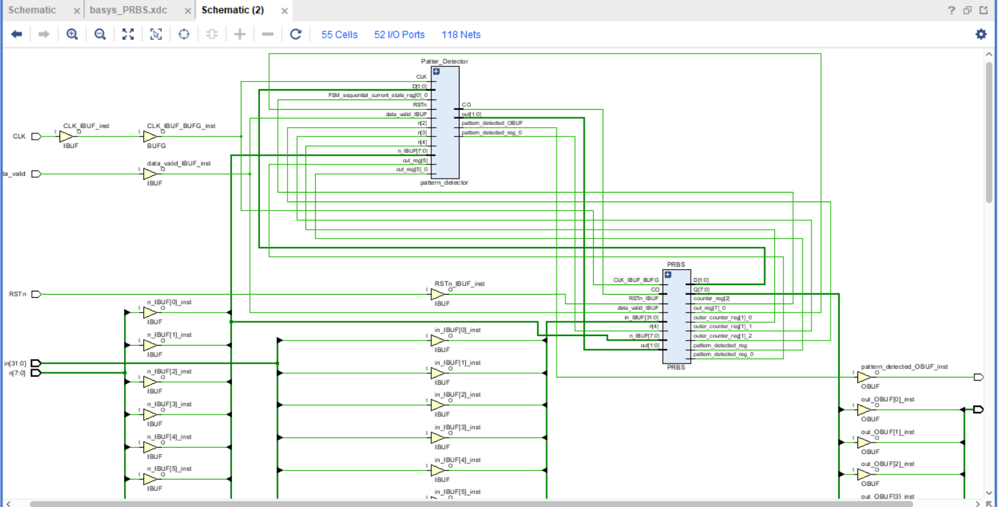
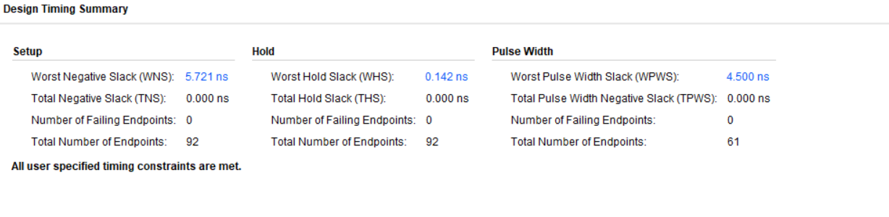
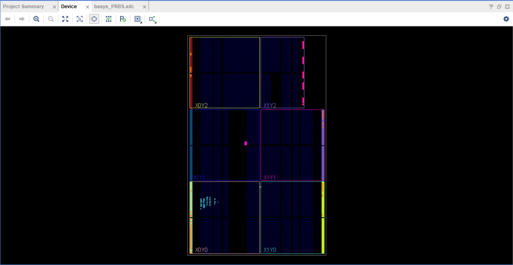

# PRBS with a pattern detector


## PRBS
### Block summary
Takes a 4 byte input **in** and outputs it one byte at time **n** times if **data_valid** is high then generates a random output each cycle.

``` systemverilog
module PRBS (
    input bit CLK,
    input logic RSTn,
    input logic data_valid,
    input logic [7:0] n,
    input logic [31:0] in,
    output logic [7:0] out
);
    reg [14:0] LSFR;
    reg pattern_done;
    reg [7:0] inner_counter;
    reg [7:0] outer_counter;

    always @(posedge CLK or negedge RSTn ) begin
        if (!RSTn) begin
            out <= 0;
            LSFR <= in[14:0];
            pattern_done <= 1'b0;
            inner_counter <= 0;
            outer_counter <= 0;
        end
        else if (!data_valid)begin
            out <= 0;
            pattern_done <= 1'b0;
            inner_counter <= 0;
            outer_counter <= 0;
        end
        else if (!pattern_done) begin
            case (inner_counter)
                0 : begin
                   out <= in[31:24];
                   inner_counter <= inner_counter +1;
                end
                1 : begin
                    out <= in[23:16];
                    inner_counter <= inner_counter +1;
                end 
                2 : begin
                    out <= in[15:8];
                    inner_counter <= inner_counter +1;
                end
                3 : begin
                   out <= in[7:0];
                   if (outer_counter == (n-1)) begin
                        outer_counter <= 0;
                        inner_counter <= 0;
                        pattern_done <= 1'b1;
                   end
                   else begin
                        outer_counter <= outer_counter +1;
                        inner_counter <= 0; 
                   end 
                end
                default: begin
                    out <= 8'h00;
                    inner_counter <= 0;
                    outer_counter <= 0;
                    pattern_done <= 1'b0;
                end 
            endcase
        end
        else begin
            LSFR <= {LSFR[13:0],(LSFR[13]^LSFR[14])};
            out <= LSFR[7:0];   
        end
    end

endmodule

```

## pattern detector
### Block summary
Receives the output of the PRBS and checks if the pattern matches and for the right amount of times. 
```systemverilog
module pattern_detector#(
    parameter PATTERN =32'hAABBCCDD
) (
    input bit CLK,
    input logic RSTn,
    input logic data_valid,
    input logic [7:0] in,
    input logic [7:0] n,
    output logic pattern_detected
);
    typedef enum {
        first_byte,
        second_byte,
        third_byte,
        fourth_byte
    } state_e;

    state_e current_state;
    state_e next_state;

    logic flag;
    logic [7:0] counter;

    //state transition
    always @(posedge CLK or negedge RSTn) begin
        if (!RSTn) begin
            current_state <= first_byte;    
        end
        else begin
            current_state <= next_state;
        end
    end


    //next state logic
    always @(*) begin
        case (current_state)
            first_byte: begin
                if (!data_valid) begin
                    next_state = first_byte;
                end
                else if (in==PATTERN[31:24]) begin
                    next_state = second_byte;
                end
                else begin
                    next_state = first_byte;
                end
            end
            second_byte: begin
                if (!data_valid) begin
                    next_state = first_byte;
                end
                else if (in==PATTERN[23:16]) begin
                    next_state = third_byte;
                end
                else begin
                    next_state = first_byte;
                end
            end
            third_byte: begin
                if (!data_valid) begin
                    next_state = first_byte;
                end
                else if (in==PATTERN[15:8]) begin
                    next_state = fourth_byte;
                end
                else begin
                    next_state = first_byte;
                end
            end
            fourth_byte: begin
                next_state = first_byte;
            end
            default: begin
                next_state = first_byte;
            end
        endcase
    end

    //output logic
    always @(*) begin
        case (current_state)
            first_byte: begin
                flag = 0;
            end 
            second_byte: begin
                flag = 0;
            end 
            third_byte: begin
                flag = 0;
            end 
            fourth_byte:begin
                if (in == PATTERN[7:0]) begin
                    flag = 1;    
                end
                else begin
                    flag = 0;
                end
            end 
            default: begin
                flag = 0;
            end
        endcase
    end

    always @(posedge CLK or negedge RSTn) begin
        if (!RSTn) begin
            counter <= 0;
            pattern_detected <= 0;
        end
        else if (!data_valid) begin
            counter <= 0;
            pattern_detected <= 0;
        end 
        else if(current_state==fourth_byte && !flag)begin
            counter <= 0;
        end
        else if (current_state==fourth_byte && flag) begin
            if (counter == (n-1)) begin
                counter <= 0;
                pattern_detected <= 1;
            end
            counter <= counter + 1;
        end
    end
endmodule
```
## Testbench

the testbench covers the reset function and several right transactions with different **n** and one intended wrong transaction to check if the error is detected. 

### signals module instantiation and clock generation
```
    bit CLK;
    logic RSTn;
    logic data_valid;
    logic [7:0] n;
    logic [31:0] in;
    logic [7:0] out;
    logic pattern_detected;

    parameter PATTERN = 32'h AB_CD_EF_CD;

    integer error_counter = 0;
    integer correct_counter = 0;

    //CLK generation
    initial begin
        forever begin
            #1 CLK = ~CLK;
        end
    end

    PRBS_PD_WPR #(PATTERN) DUT (
    .CLK(CLK),
    .RSTn(RSTn),
    .data_valid(data_valid),
    .in(in),
    .n(n),
    .out(out),
    .pattern_detected(pattern_detected)
    );
```

### initial block

```
    initial begin
        RST_CHECK();
        right_pattern_check(32'h AB_CD_EF_CD,3);
        @(negedge CLK);
        right_pattern_detection_check();
        
        @(negedge CLK);
        
        right_pattern_check(32'h AB_CD_EF_CD,2);
        @(negedge CLK);
        right_pattern_detection_check();
        
        @(negedge CLK);
        
        wrong_pattern_check(32'hAA_BB_CC_DD,1);
        @(negedge CLK);
        wrong_pattern_detection_check();
              
        @(negedge CLK);

        report();
        $stop;
    end

```

### TASKS
```
task automatic RST_CHECK();
        RSTn = 0;
        in = PATTERN;
        n=0;
        data_valid =0;
        repeat(3) @(negedge CLK);
        if (out!=0 || pattern_detected!=0) begin
            $display("ERROR: RST_CHECK failed");
            error_counter = error_counter + 1;
        end
        else correct_counter = correct_counter + 1;
        @(negedge CLK);
        RSTn = 1;
    endtask //automatic

    task automatic right_pattern_check(input [31:0]IN , input [7:0] N);
        data_valid = 0;
        @(negedge CLK);
        data_valid = 1;
        n=N;
        in = IN;
        @(negedge CLK);
        for( integer j = 0; j < n ; j++) begin
            for ( integer i = 0; i < 4 ; i++ ) begin
                    if (i==0) begin
                        if(out!=PATTERN[31:24]) begin
                            $display("ERROR PATTERN CHECK failed");
                            error_counter = error_counter + 1;
                        end
                        else correct_counter = correct_counter + 1;    
                    end
                    if (i==1) begin
                        if(out!=PATTERN[23:16]) begin
                            $display("ERROR PATTERN CHECK failed");
                            error_counter = error_counter + 1;
                        end
                        else correct_counter = correct_counter + 1;
                    end
                    if (i==2) begin
                        if(out!=PATTERN[15:8]) begin
                            $display("ERROR PATTERN CHECK failed");
                            error_counter = error_counter + 1;
                        end
                        else correct_counter = correct_counter + 1;
                    end
                    if (i==3) begin
                        if(out!=PATTERN[7:0]) begin
                            $display("ERROR PATTERN CHECK failed");
                            error_counter = error_counter + 1;
                        end
                        else correct_counter = correct_counter + 1;
                    end
                    @(negedge CLK);
                end 
        end
        
        right_pattern_detection_check(); 

    endtask //automatic

    task automatic right_pattern_detection_check();
        if (!pattern_detected) begin
            $display("ERROR Pattern detection check failed");
            error_counter = error_counter + 1;
        end
        else correct_counter = correct_counter + 1;
        @(negedge CLK);
    endtask //automatic

    task automatic wrong_pattern_check(input [31:0]IN , input [7:0] N);
        data_valid =0;
        @(negedge CLK);
        data_valid = 1;
        in=IN;
        n=N;
        @(negedge CLK);
        for( integer j = 0; j < n ; j++) begin
            for ( integer i = 0; i < 4 ; i++ ) begin
                    if (i==0) begin
                        if(out==PATTERN[31:24]) begin
                            $display("ERROR PATTERN did not change");
                            error_counter = error_counter + 1;
                        end
                        else correct_counter = correct_counter + 1;    
                    end
                    if (i==1) begin
                        if(out==PATTERN[23:16]) begin
                            $display("ERROR PATTERN did not change");
                            error_counter = error_counter + 1;
                        end
                        else correct_counter = correct_counter + 1;
                    end
                    if (i==2) begin
                        if(out==PATTERN[15:8]) begin
                            $display("ERROR PATTERN did not change");
                            error_counter = error_counter + 1;
                        end
                        else correct_counter = correct_counter + 1;
                    end
                    if (i==3) begin
                        if(out===PATTERN[7:0]) begin
                            $display("ERROR PATTERN did not change");
                            error_counter = error_counter + 1;
                        end
                        else correct_counter = correct_counter + 1;
                    end
                    @(negedge CLK);
                end 
        end
        
        wrong_pattern_detection_check();
    endtask //automatic


    task automatic wrong_pattern_detection_check();
        if (pattern_detected) begin
            $display("ERROR wrong Pattern detect as right");
            error_counter = error_counter + 1;
        end
        else correct_counter = correct_counter + 1;
        @(negedge CLK);
    endtask //automatic

    ////////////////test report/////////////
    task automatic report();
        if (error_counter == 0 ) begin
            $display("Test is over DUT is working well");
        end
        else begin
            $display("Test is over DUT is NOT working well with %d errors",error_counter);
        end
        
    endtask //automatic
```

## Simulation results and Waveforms



## Elaborated design


## Synthesis 
### Schematic

### Timing Report


## Implemented Design



## Generated Bit stream 

[PRBS_PD_WPR.bit](report/PRBS_PD_WPR.bit)

